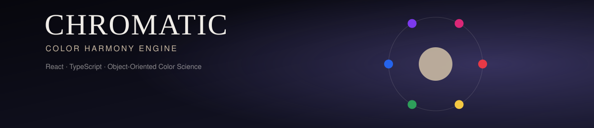
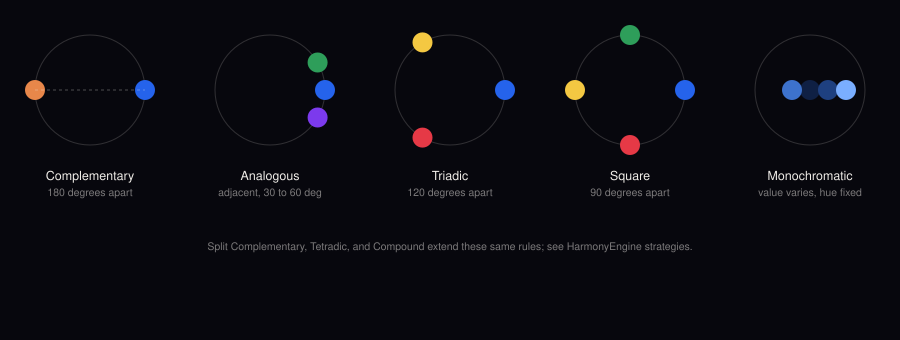
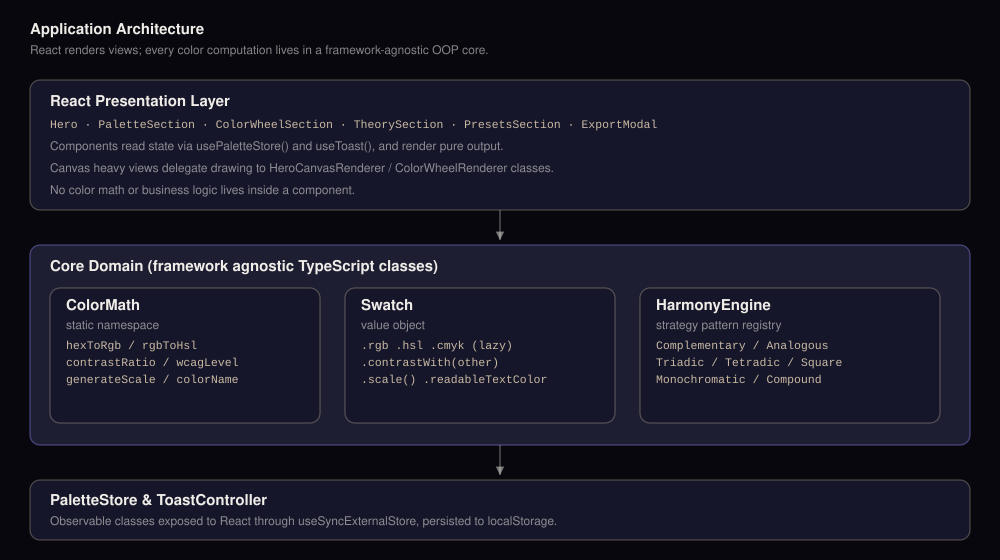

<p align="center">
  
</p>

<p align="center">
  
  
  
  
  
  
</p>

<h1 align="center">Chromatic</h1>
<p align="center"><strong>A professional color intelligence engine, rebuilt in React, TypeScript, and object-oriented color science.</strong></p>

<p align="center">
  <a href="https://hassanireza.github.io/chromatic/">Live Demo</a> &#183;
  <a href="#features">Features</a> &#183;
  <a href="#architecture">Architecture</a> &#183;
  <a href="#getting-started">Getting Started</a> &#183;
  <a href="#deployment">Deployment</a>
</p>

---

## Overview

Chromatic generates mathematically precise color systems grounded in perceptual science, harmonic color theory, and professional design practice. Start from any hex code, or from nothing, and get a palette built on the same rules used by Adobe, Pantone, and leading design systems.

This is a full migration of the original vanilla JavaScript build into a strictly typed, component based, object-oriented React application. The rebuild keeps every original feature intact while restructuring the color engine into reusable, independently testable TypeScript classes, and adds a set of new capabilities described below.

<p align="center">
  
</p>

---

## Features

**Palette generation**
- Eight harmony strategies: Complementary, Analogous, Triadic, Tetradic, Split Complementary, Square, Monochromatic, and Compound
- Seed from any hex value or generate a random vivid starting point
- Two to ten color palettes with live regeneration

**Interactive color wheel**
- Canvas rendered hue ring with pointer and touch dragging
- Saturation and lightness picker with a live preview swatch
- Instant hex, RGB, HSL, and CMYK readouts
- Harmony preview that mirrors the currently selected palette rule

**Analysis views**
- Swatch view with one-click hex copy
- Tint and shade view: a ten-step scale per color, from near black to near white
- WCAG 2.1 contrast matrix across every color pair, with AA, AAA, and AA Large badges

**Reference library**
- Six color theory cards with the underlying hue formula for each harmony
- A twelve-color psychology reference with associated traits
- Twelve professional tips covering accessibility, hierarchy, and perceptual contrast

**Curated palettes**
- Sixteen preset palettes across editorial, brand, digital, print, and nature categories
- Category filtering and one-click load into the active palette

**Export**
- CSS custom properties, SCSS variables and map, JSON, Adobe Swatch Exchange style tokens, and a Tailwind config snippet
- One-click clipboard copy for any format

### New in this rebuild

| Addition | Why it was added |
|---|---|
| Strict TypeScript across the entire codebase | Compile-time safety for every color calculation and component prop |
| Object-oriented color engine (`ColorMath`, `Swatch`, `HarmonyEngine`, `PaletteExporter`) | Framework-agnostic, unit-testable core, decoupled from React |
| Strategy pattern for harmonies and exporters | New harmony types or export formats can be added without touching existing code |
| Observable `PaletteStore` and `ToastController` | Predictable, framework-agnostic state, integrated with React via `useSyncExternalStore` |
| Palette persistence | The active palette, seed, and harmony are saved to `localStorage` and restored automatically |
| CI/CD pipeline | Every push to `main` is type-checked, built, and deployed to GitHub Pages automatically |
| Accessible favicon and semantic HTML pass | Cleaner heading structure and alt text throughout |

---

## Architecture

<p align="center">
  
</p>

The codebase separates the presentation layer from the color science entirely. React components never compute color math directly; they call into the OOP core and render the result.

```
src/
├── core/                    Framework-agnostic OOP color engine
│   ├── ColorMath.ts          Static color space conversions and WCAG math
│   ├── Swatch.ts              Value object wrapping a single color
│   ├── HarmonyEngine.ts       Strategy pattern: one class per harmony rule
│   ├── PaletteExporter.ts     Strategy pattern: one class per export format
│   ├── PaletteStore.ts        Observable application state
│   ├── HeroCanvasRenderer.ts  Encapsulated hero canvas animation
│   └── ColorWheelRenderer.ts  Encapsulated interactive wheel + SL picker drawing
│
├── components/               React presentation layer
│   ├── Hero.tsx, HeroCanvas.tsx
│   ├── PaletteSection.tsx
│   ├── ColorWheelSection.tsx
│   ├── TheorySection.tsx
│   ├── PresetsSection.tsx
│   ├── ExportModal.tsx
│   ├── Nav.tsx, Toast.tsx, Footer.tsx, CustomCursor.tsx
│
├── hooks/                     React bindings for the OOP stores
│   ├── usePaletteStore.ts
│   └── useToast.ts
│
├── data/                       Static reference content
│   ├── presets.ts, psychology.ts, tips.ts, theory.ts
│
├── types/color.ts              Shared type definitions
├── styles/global.css           Design system and component styles
├── App.tsx
└── main.tsx
```

### Design patterns used

- **Strategy pattern**: `HarmonyEngine` and `PaletteExporter` each hold a registry of interchangeable strategy classes, so adding a ninth harmony type or a sixth export format never requires editing existing logic.
- **Value object**: `Swatch` wraps a single hex color and lazily derives every other representation (RGB, HSL, CMYK, contrast text, name), caching each on first access.
- **Observer / observable store**: `PaletteStore` and `ToastController` are plain classes exposing `subscribe` and `getState`, consumed by React through `useSyncExternalStore` rather than a bespoke context provider.
- **Facade**: `ColorMath` is a static namespace class that hides every color space formula behind a small, well-named surface.

---

## Getting Started

### Prerequisites

- Node.js 20 or later
- npm 10 or later

### Installation

```bash
git clone https://github.com/hassanireza/chromatic.git
cd chromatic
npm install
```

### Development

```bash
npm run dev
```

Opens the app locally with hot module reloading.

### Type checking and linting

```bash
npm run typecheck
npm run lint
```

### Production build

```bash
npm run build
npm run preview
```

`npm run build` type-checks the entire project before bundling, so a broken build never reaches `dist/`.

---

## Deployment

Chromatic deploys automatically to GitHub Pages through GitHub Actions.

<p align="center">
  <em>push to main &#8594; typecheck &#8594; build &#8594; upload artifact &#8594; deploy</em>
</p>

The workflow at `.github/workflows/deploy.yml` runs on every push to `main`:

1. Checks out the repository and installs dependencies with `npm ci`
2. Runs `npm run typecheck` so a type error blocks deployment
3. Builds the production bundle with `npm run build`
4. Uploads `dist/` as a Pages artifact and deploys it

### One-time repository setup

1. Push this repository to GitHub under the name `chromatic` (or update `base` in `vite.config.ts` to match your repository name).
2. In the repository settings, open **Pages** and set the source to **GitHub Actions**.
3. Push to `main`. The site will be live at `https://<your-username>.github.io/chromatic/` once the workflow completes.

---

## Tech Stack

| Layer | Technology |
|---|---|
| UI framework | React 18 |
| Language | TypeScript 5, strict mode |
| Build tool | Vite 5 |
| Styling | Hand-authored CSS with custom properties, no framework dependency |
| State | Observable classes via `useSyncExternalStore` |
| CI/CD | GitHub Actions to GitHub Pages |

---

## Color Science Reference

Every conversion in `ColorMath` follows a standard, well-documented formula:

- RGB to HSL and back use the standard hue/chroma decomposition.
- CMYK conversion uses the naive subtractive model (`k = 1 - max(r,g,b)`), suitable for on-screen preview rather than print-accurate color separation.
- Contrast ratio and relative luminance follow WCAG 2.1 exactly, including the sRGB linearization step.
- WCAG level thresholds: AA at 4.5:1, AAA at 7:1, and Large Text AA at 3:1.

---

## License

MIT. Free to use, modify, and distribute.

<p align="center">
  <sub>Built on color science, harmonic mathematics, and perceptual theory. For designers who demand precision.</sub>
</p>
